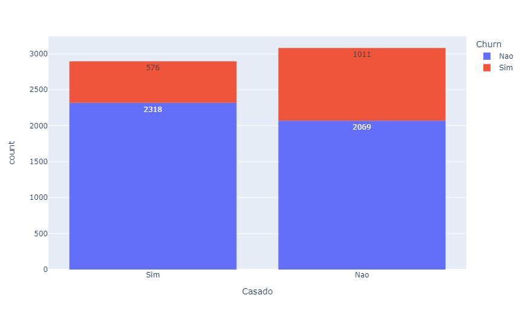
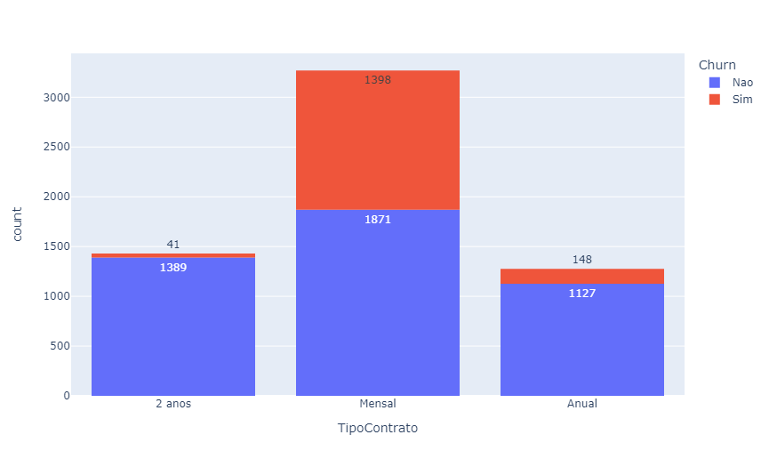
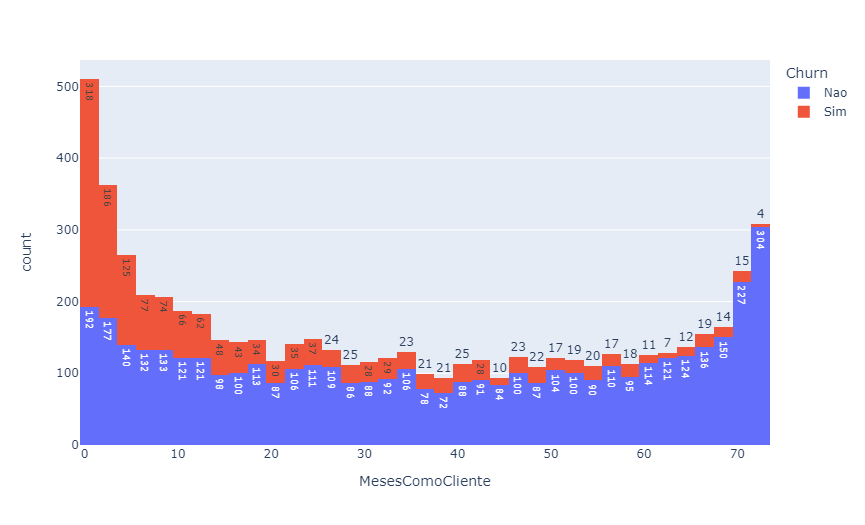

# Análise de Churn Rate

## Sumário

* [Sobre o projeto](#sobre-o-projeto)
* [About the project](#about-the-project)
* [Linguagens e tecnologias usadas](#linguagens-e-tecnologias-usadas)
* [Bibliotecas Python usadas](#bibliotecas-python-usadas)
* [Passo a passo da solução](#passo-a-passo-da-solução)
* [Gráficos](#gráficos)
* [Conclusões](#conclusões)
* [Créditos](#créditos)
* [Contato](#contato)

## Sobre o projeto

Esse repositório contém uma solução para um desafio envolvendo análise de dados e é organizado de maneira detalhada e acessível, podendo ser entendida por quem é iniciante na linguagem Python.

**Desafio:** Analisar os dados de uma empresa de telecomunicações, e descobrir o que pode ser feito para diminuir o Churn Rate, ou seja, a taxa de cancelamento de serviços realizados pelos clientes. Na base de dados apresentada, a Churn Rate é maior que 26%.

Estão disponibilizados neste repositório os seguintes arquivos: a base de dados, que contém informações de, aproximadamente, 6000 clientes e os serviços assinados; a solução detalhada; a solução final, adaptada para o Visual Studio Code a partir da solução detalhada, mas desenvolvida sem a poluição visual dos comentários; e a pasta com os gráficos gerados no código.

## About the project

This repository contains a solution to a challenge involving data analysis and is organized in a detailed and accessible way that can be understood by anyone who is new to the Python language.

**Challenge:** Analyze the data of a telecommunications company, and find out what can be done to reduce the Churn Rate, that is, the rate of cancellation of services performed by customers. In the presented database, the Churn Rate is greater than 26%.

The following files are available in this repository: the database, which contains information on approximately 6000 customers and subscribed services; the detailed solution; the final solution, adapted for Visual Studio Code from the detailed solution, but developed without the visual clutter of comments; and the folder with the graphics generated in the code.

## Linguagens e tecnologias usadas

* [Jupyter Notebook](https://jupyter.org/)
* [Visual Studio Code](https://code.visualstudio.com/download)
* [Python 3.11](https://www.python.org/)
* [Markdown](https://www.markdownguide.org/)

## Bibliotecas Python usadas

* [Pandas](https://pandas.pydata.org/)
* [Plotly Express](https://plotly.com/python/)

## Passo a passo da solução

* Passo 1: Importar a base de dados
* Passo 2: Visualizar a base de dados
* Passo 3: Tratar os dados
    * 3.1 Verificar as variáveis de cada coluna
    * 3.2 Excluir colunas desnecessárias
    * 3.3 Analisar as células vazias
* Passo 4: Analisar os dados
    * 4.1 Analisar Graficamente

## Gráficos 

Com o código, foram gerados 20 gráficos, em formato de histogramas, comparando a coluna de "Churn" com as outras da base de dados. Tais gráficos podem ser encontrados dentro da pasta "Gráficos", mas abaixo estão três exemplos, referentes às colunas de "Casado", "TipoContrato" e "MesesComoCliente", respectivamente. 

Em Azul, temos as pessoas que não continuam com os serviços e, em laranja, as que cancelaram. No eixo $y$ está escrito "count" o que representa a quantidade de pessoas.

## Conclusões

A partir da análise dos gráficos, podemos gerar algumas hipóteses interessantes, mas algumas delas dependem de ser testadas. Outras são suficientemente claras, supondo que a base de dados é representativa. Com isso, sugerimos novas práticas para a empresa conseguir aumentar a fidelidade dos clientes, direcionar investigações, bem como deixar os serviços mais atrativos. 

Por exemplo, pode-se usar promoções e planos para direcionar o cliente para métodos que tendem a fidelizá-lo, o que acaba sendo bom para o cliente e para a empresa. Os resultados em nossa análise fazem muito sentido com o que é observado nas grandes empresas de assinaturas de serviços, como as de telecomunicações e streaming.

$\phantom{a}$

### <b> Sobre as informações pessoais </b>

Nesse tópico, vemos que ter família é um ponto relevante, pois as pessoas casadas e com dependentes tendem a manter os serviços. Outras informações, como gênero e se a pessoa é aposentada, não deram resultados significativos.

**Sugestão:** Pode-se disponibilizar serviços com planos familiares, oferecendo mais serviços por preços melhores, como uma linha adicional ou o serviço de segurança online, por exemplo. Planos familiares são usados por inúmeras empresas grandes, como Netflix e Spotify. 

$\phantom{a}$

### <b> Sobre o tempo e dinheiro investido pelo cliente </b>

Observando as tabelas relacionadas ao tempo como cliente e o total de dinheiro gasto, é possível perceber que quanto mais tempo e quanto mais dinheiro gasto, menos clientes cancelam os serviços. Nos primeiros meses e nas menores quantidades de dinheiro investidas, a desistência dos serviços é absurdamente mais alta.

**Sugestão:** É possível que a primeira experiência dos clientes com os serviços estejam sendo ruins ou, também, que a captação de clientes esteja trazendo clientes desqualificados, sendo necessário mudar as estratégias de marketing. Para entender melhor os motivos, vale a pena enviar uma pesquisa de satisfação sempre que alguém cancelar os serviços. Uma ideia interessante é criar incentivos para o cliente ficar mais tempo e ser fidelizado, como, por exemplo, dar uma promoção para os primeiros meses ou primeiro ano de uso, o que também é uma estratégia usada por grandes empresas.

$\phantom{a}$

### <b> Sobre os serviços </b>

A partir das tabelas relacionadas aos serviços, como "ServicoTelefone", "MultiplasLinhas", "ServicoSegurancaOnline", entre outros, vemos que quanto mais serviços, menores as chances de acontecer o churn. A única exceção é o "ServicoInternet", que está com uma alta taxa de cancelamento.

**Sugestão:** Oferecer planos com múltiplos serviços, o que também é feito por grandes empresas, e pesquisa de satisfação para os usuários do serviço de internet.

$\phantom{a}$

### <b> Sobre o pagamento </b>

Ao observar as tabelas "TipoContrato", "FormaPagamento" e "FaturaDigital" identificar que os clientes com contrato mensal tem muito mais chance de cancelar, o mesmo acontece com quem pagar usando boleto e quem recebe a fatura digitalmente.

**Sugestão:** Aparentemente os métodos em que os clientes lembram recorrentemente de pagar os serviços ou que dão mais trabalho são os que trazem maiores números de Churn Rate. Dessa forma, é necessário deixar os métodos que dão menos trabalho mais atrativos, com promoções ou outras vantagens. É possível, também, ensinar a fazer o pagamento da fatura automaticamente.

$\phantom{a}$

## Créditos 

O desafio, bem como muitos detalhes de sua resolução, se devem ao João Lira, do canal do 
Youtube [Hashtag Programação](https://www.youtube.com/@HashtagProgramacao). A base de dados é uma adaptação de uma outra, encontrada na plataforma [Kaggle](https://www.kaggle.com/), que contém inúmeras bases de dados públicas e desafios, alguns até pagando pela resolução.

## Contato

Criado por Adriano Jr. G. Gonçalves - Sinta-se à vontade para contribuições, críticas, dúvidas e/ou sugestões.

 
   
  

